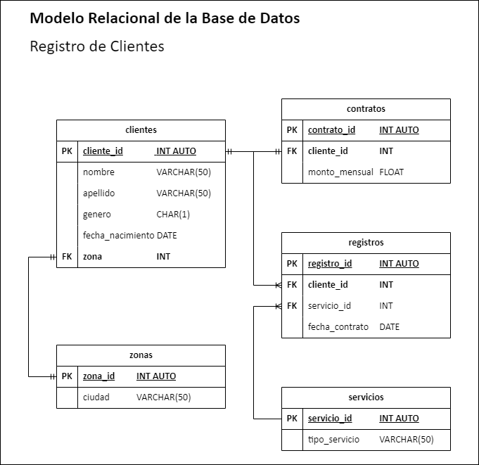

# registroClientesDB

Desarrollo de un modelo de base de datos para el registro de clientes

# Registro Clientes

## Normalización de la base de datos

[Normalización de la Base de Datos existente](https://www.youtube.com/watch?v=ppdnC41HK2M)

## Listado de Entidades

### clientes **(ED)**

- cliente_id **(PK)**
- nombre
- apellido
- genero
- fecha_nacimiento
- zona **(FK)**

### contratos

- contrato_id **(PK)**
- cliente_id **(FK)**
- monto_mensual

### registros **(EP)**

- registro_id **(PK)**
- cliente_id **(FK)**
- servicio_id **(FK)**
- fecha_contrato

### servicios **(EC)**

- servicio_id **(PK)**
- tipo_servicio

### zonas **(EC)**

- zona_id **(PK)**
- ciudad

## Relaciones

1. Un **cliente** _pertenece_ a una **zona** (_1 - 1_).
1. Un **contrato** _pertenece_ a un **cliente** (_1 - 1_).
1. Un **cliente** _tiene_ uno o muchos **registros** (_1 - M_).
1. Un **servicio** _tiene_ uno o muchos **registros** (_1 - M_).

### Modelo Relacional

